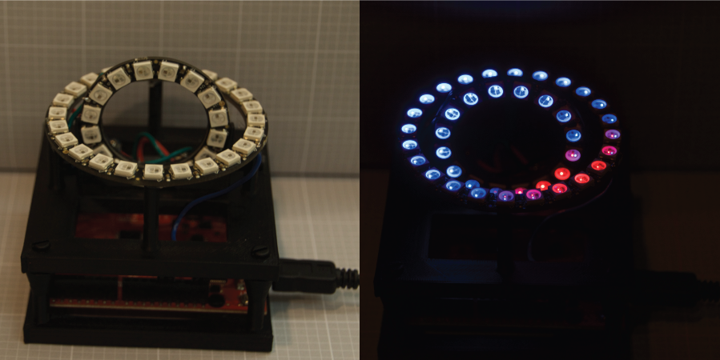

# 3D Compass

## Bill of Materials
- (1) [Arduino UNO (Red board from SparkFun)](https://www.sparkfun.com/products/12757) $19.95/ea
- (1) [NeoPixel Ring - 16 Element](http://www.adafruit.com/products/1463) $9.95/ea
- (1) [NeoPixil Ring - 24 Element](http://www.adafruit.com/products/1586) $19.95/ea
- (1) [1000uF Capacitor - 6.3V or higher](https://www.sparkfun.com/products/8982) $0.35/ea
- (1) [HMC5883L Magnetometer](http://www.adafruit.com/products/1746) $9.95/ea
- (10) [Brass Heat-Set Insert 4-40](http://www.mcmaster.com/#93365a122/=ub3kod) $11.48/pk. 100
- 0.1" Header Pins
- Hook-up wire (solid)
- 300-500 Ohm Resistor (1/8 watt)
- Nylon 4-40 Screws (1/2 - 1" length)

## Tools Required
- Hobby Knife
- Drill
- Drill Bit 7/64"
- Soldering Iron/Solder
- Flat-head screwdriver
- Hot Glue Gun/Glue
- USB mini cable

## Mechanical Assembly Instructions

### 3D Printing Brackets
- Print 1 top and 1 bottom bracket. 60% infill and a raft are recommended.
- Using a soldering iron, insert the heat-set thread inserts. Eight in
bottom plate, 4 in riser posts, 4 in Arduino mounts. Two in top plate for
magnetometer mounts. [Demonstration Video](http://youtu.be/NXAhOEn8nXQ)

### Assemble Top Plate
- Attach the magnetometer with 4-40 nylon screws. Shear the excess length flush
with the bottom of the plate using a hobby knife. Be careful to not break
the superstructure on the printed part.
- Place the capacitor into the cut-out and secure with a drop of hot glue.
- Solder ~5 cm of wire onto the data in line on the 16-element ring.
- Place the 16-element NeoPixel ring into the vertical ring holder. Thread the
data-in line through the hole in the bracket. This ensures that data-in, V+,
and GND are all accessable. Secure with a drop of hot-glue.
- Place the 24-element NeoPixel ring onto the riser posts. Line up the data-out
pad to be near the data-in line on the smaller ring. The LED should be directly
above the mounting post. Secure with hot-glue on each post.

### Assemble Bottom Plate
- Secure the Arduino RedBoard to the base plate with 4-40 nylon screws. Shear
the excess length flush with the bottom of the plate using a hobby knife.

### Attaching the Plates
- Using the 4-40 nylon screws, attach the top and bottom plates. Shear
the excess length flush with the bottom of the plate using a hobby knife. You
may prefer to do the wiring with the screws out for easy access, but it
shouldn't be too much of a problem.

## Wiring Instructions
* See photos on how to make this easier with header.
- Trim and solder the data-in wire on the vertical ring to the data-out pad
on the 24-element ring.
- Connect the data-in pad on the 24-element horizontal ring to pin 13 on the
Arduino. The resistor goes in-line here as well. You can use 0.1" header to make this easier to assemble and troubleshoot.
- Connect a ground pad from the 24-element horizontal ring to a ground pad
on the 16-element vertical ring.
- Connect the second ground pad on the 16-element vertical ring to the ground
size of the capacitor (marked with -- on the case).
- Connect the ground side of the capacitor to GND on the Arduino. Header can
make this easier.
- Connect the power pads of both rings to the positive side of the capacitor.
- Connect the positive side of the capacitor to +5VDC on the Arduino.
- Connect the GND, SDA, and SCL pins of the magnetometer to GND, SDA, and SCL
on the Arduino.
- Connect the power pin of the magnetometer to the +3.3VDC pin on the Arduino.

## Programming
- Install the [NeoPixel](https://github.com/adafruit/Adafruit_NeoPixel),
[Adafruit Sensor](https://github.com/adafruit/Adafruit_Sensor), and
[Magnetometer](https://github.com/adafruit/Adafruit_HMC5883_Unified) libraries.
For help, see the [library tutorial.](https://learn.adafruit.com/adafruit-all-about-arduino-libraries-install-use)
- Connect the Arduino to your computer and upload the code in the Arduino/Vector_Display directory (see the [Arduino guide](http://arduino.cc/en/Guide/HomePage)) if you need help uploading programs to the Arduino.
- Play with parameters such as brightness and grading to create your own display!

## Activity Ideas
You can learn a lot from your new compass/magnetometer! In addition to learning about the
electronics and hardware, you can learn about magnetic fields and the Earth's geodynamo. Below are a few links to get you started and some ideas. Please contribute any experiments or activities that you develop!

- Learn how magnetometer calibration works ([Freescale App Note](http://www.freescale.com/files/sensors/doc/app_note/AN4246.pdf))
- Measure the diurnal variation in [Earth's magnetic field](http://geophysics.ou.edu/solid_earth/notes/mag_earth/earth.htm)
- See how good of a [metal detector](http://en.wikipedia.org/wiki/Metal_detector) you built
- Detect the movement of metal objects like a desk drawer
